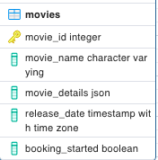

# Local Setup for Services and Database

## 1. Install NodeJS

[Download](https://www.postgresql.org/download/) NodeJS `v18.17.1`
## 2. Database Setup
1. [Download](https://www.postgresql.org/download/) and Install pgAdmin 4 `v7.7`
2. Open pgAdmin and Create Dabases and tables as following:
   
   Database name: `movie_theaters_db`

   Create the following Tables:

   1. movies

   

## 3. Install Postman
[Download](https://www.postman.com/downloads/) postman for api testing.

## 4. Run Project

1. In the path of the `movies` folder install dependencies with command `npm install`. This will install all the dependencies mentioned in the `package.json`

2. Run command `npm run dev` to start the server.

NOTE: Update `/movies/.env` file for the configuring PORT and Database Details.